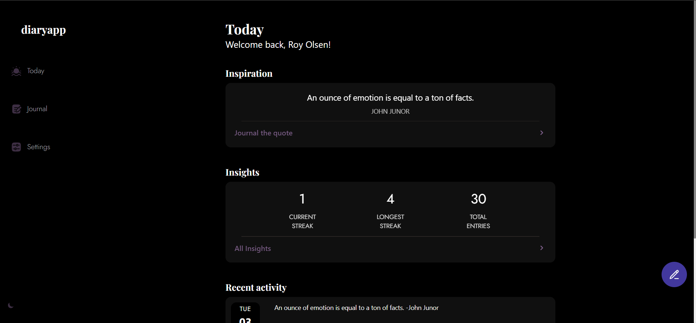
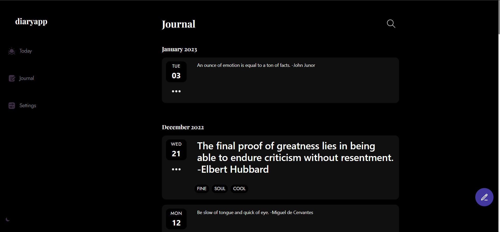
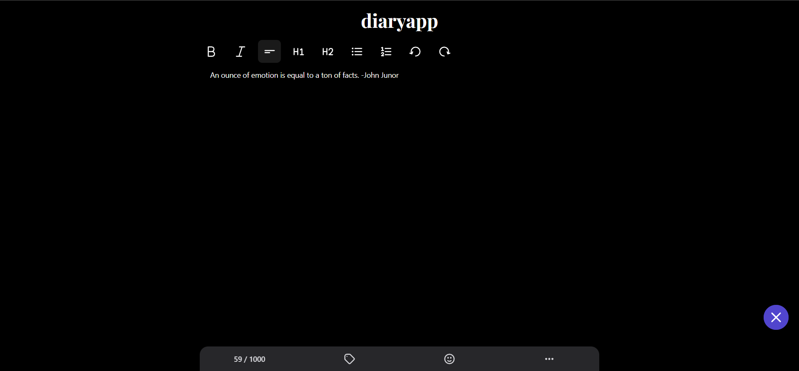
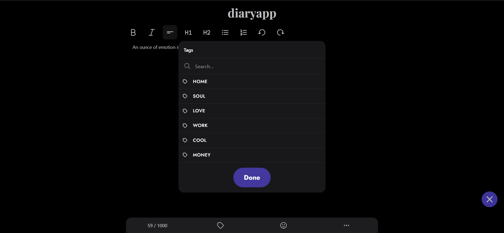
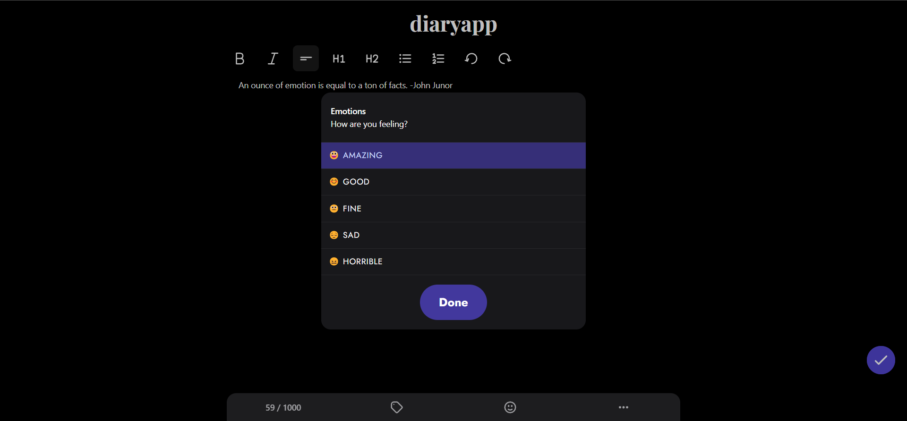
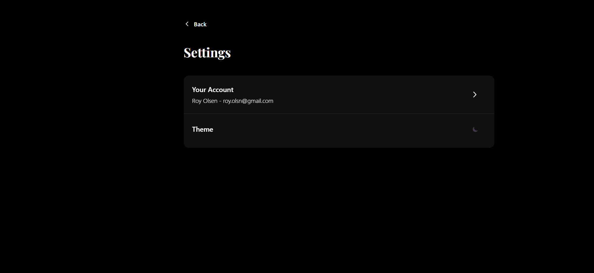
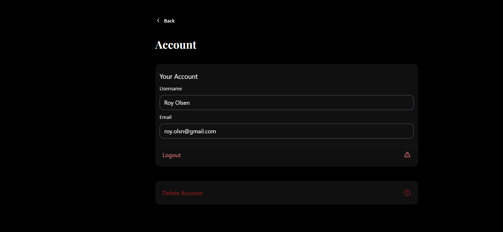

# Description

diaryapp is a tool for saving, searching, accessing you daily diary entries.

# Technologies

- **Next.js 12**
- **Tailwind CSS 3**
- **TypeScript**
- **ESLint**
- **Prettier**
- **Husky**
- **Redux-Toolkit** - State Management
- **React Query** - State Management
- **NextAuth.js** - Authentication
- **Absolute import** - Import folders and files using the `@` prefix

# Feature Roadmap

- Design

  - [x] Dark and light mode themes
  - [x] Smooth page transition using Framer Motion
  - [x] Custom made responsive components and elements using Tailwind, Tailwind Styled Components and CVA
  - [x] Mobile and desktop navigation
  - [ ] Highlight active route in navigation (Sidebar, ...)
  - [x] Demo area where user can try out the app without having to sign up

- Insights

  - [x] Current streak in days
  - [x] Longest streak in days
  - [x] Total words written
  - [ ] Most used tags and emotions

- Settings

  - [x] User can sign out
  - [x] User can delete its account

- Entry Editor

  - [x] Custom text transformation functions (make text bold, italic, ...)
  - [x] Ability to undo or redo changes
  - [x] Option to add custom tags to the entry
  - [x] Option to pick a suitable emotion
  - [x] Option to delete an entry
  - [x] Display maximum text characters per entry
  - [ ] Limit amount of tags a user can add

- Backend

  - [x] Auth using NextAuth.js
  - [x] API routes to CRUD diary entries
  - [x] Ability for the user to delete its account and entries
  - [x] Journal entry validation with zod

- TODO

  - [ ] Unit testing with react testing library
  - [ ] E2E testing with cypress
  - [ ] Pagination / Lazy Loading for entries

# Screenshots

# Disclaimer

_diaryapp_ ("this software") is not a consumer product and provides no warranty of any kind. By using this software, you agree that you are doing so at your own risk. The creators of this software are not responsible for loss of data or other damages that may result in its operation.
